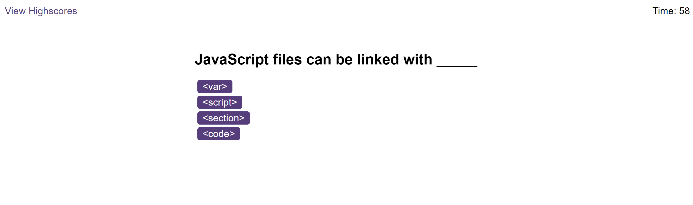

# Coding-Quiz

## Description
This project is a JavaScript web application that presents a timed quiz with various JavaScript questions. The application features a user interface built with HTML and CSS, and the functionality is powered by JavaScript.

## Features
This JavaScript Timed Quiz Application offers several key features:

- Start Button: The application begins with a start button. Upon clicking this button, a timer starts and the first question appears.
- Multiple Choice Questions: Each question contains buttons for each answer. Users select an answer by clicking on the corresponding button.
- Progress Tracking: As users navigate through the questions, they are automatically moved to the next question after selecting an answer. The application keeps track of the user's progress and displays the next question accordingly.
- Timing: If a user selects an incorrect answer, time is deducted (10 seconds) from the timer. The quiz continues until all questions have been answered or the timer reaches zero.
- High Scores: At the end of the quiz, the user's score is displayed. Users can enter their initials and submit their score to the leaderboard which is saved on LocalStorage, allowing them to compare their performance with others.
- Dynamic Content: The application uses JavaScript to dynamically update the HTML content based on user interactions. This allows for a smooth and interactive user experience.

## Usage
When you open the application, you'll see a start button. Clicking this button will begin the quiz. The quiz consists of multiple-choice questions. Select an answer by clicking on the corresponding button. Once. The quiz ends when all questions have been answered or the timer reaches zero. At the end of the quiz, your score is displayed. You can enter your initials and submit your score to the leaderboard.

You can visit the website by clicking on this [LINK](https://cntervisi.github.io/Coding-Quiz/).

Here is a screenshot of the Coding-Quiz application:

## License
This project is licensed under the MIT License. See the [license](./LICENSE) file for more details.